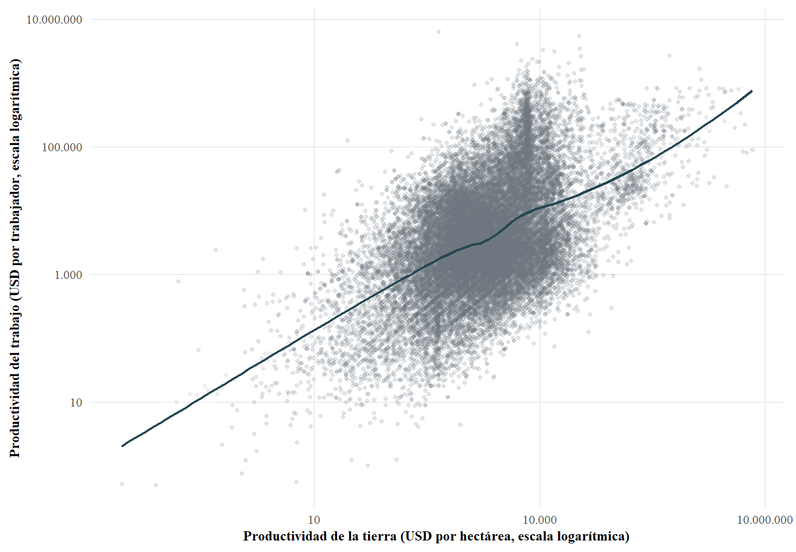
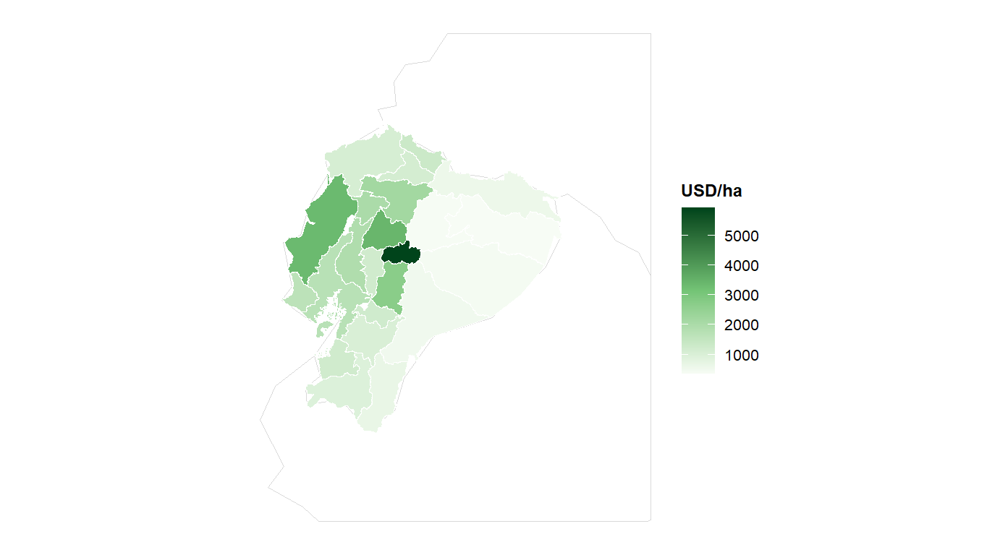
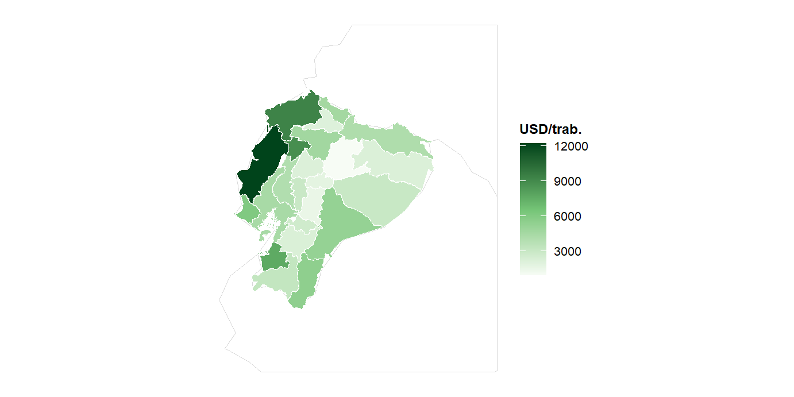

## La pregunta que guía esta investigación {.opening-slide}

¿Cómo se asocia el <strong>régimen predominante de tenencia de la tierra</strong> con la productividad de las UPA del Ecuador continental?

Tierra<small>valor bruto estimado por hectárea</small>

Trabajo<small>valor bruto estimado por persona ocupada</small>

Frontera<small>posición relativa frente a una frontera monetaria condicionada</small>

La tesis pregunta por una <strong>asociación</strong>; no identifica el efecto causal de cambiar el régimen de una misma UPA.

::: {.notes}
**Tiempo objetivo: 0:50.** Abrir con la pregunta, no con el método. Subrayar desde el inicio que el objeto es la relación entre tenencia y productividad. No hablar de “mejor” o “peor” régimen. La tercera dimensión corresponde a la posición relativa frente a una frontera monetaria condicionada.
:::

## Propiedad, tenencia y seguridad no son equivalentes

01

<h3>Propiedad</h3>

Régimen jurídico de dominio sobre la tierra.

→

02

<h3>Tenencia</h3>

Condiciones de acceso, uso, control y transferencia.

→

03

<h3>Seguridad</h3>

Estabilidad y protección efectiva de los derechos.

<strong>Bruce (2000)</strong> · <strong>FIDA (2016)</strong> · <strong>Simbizi et al. (2014)</strong> · <strong>Cotula (2022)</strong>

La ESPAC permite observar <strong>formas de tenencia</strong>; no mide directamente toda la seguridad jurídica ni la calidad contractual.

::: {.notes}
**Tiempo objetivo: 0:55.** Esta precisión conceptual protege toda la interpretación posterior. Bruce y FIDA ayudan a entender la tenencia como un conjunto de derechos; Simbizi y Cotula amplían la discusión hacia seguridad legal, consuetudinaria y percibida. No equiparar “tenencia directa” con “seguridad jurídica plena”.
:::

## ¿Por qué la tenencia podría relacionarse con la productividad?

Régimen de tenencia

↓

Horizonte de decisión

Protección de inversiones

Capacidad de transferencia

Acceso temporal a tierra

↓

Inversión

Tecnología e intensidad

Organización productiva

↓

Productividad

<strong>Besley</strong> · <strong>Deininger</strong> · <strong>Feder</strong> · <strong>Fenske</strong> · <strong>Otsuka</strong>

El mecanismo puede estar condicionado por <strong>escala · capital humano · crédito · tecnología · mercados · territorio</strong>.

::: {.notes}
**Tiempo objetivo: 1:05.** Explicar que la tenencia no actúa mecánicamente. Puede modificar incentivos y posibilidades de acceso, pero esos canales operan dentro de un contexto productivo e institucional. Esta diapositiva justifica luego las covariables y la dimensión territorial.
:::

## Ecuador llega a 2022 con una trayectoria agraria particular {.optional-30}

<strong>Formas comunitarias</strong><small>derechos colectivos y uso comunal</small>

<strong>Colonia y República</strong><small>concentración y persistencia del latifundio</small>

<strong>1964–1973</strong><small>reformas agrarias</small>

<strong>Etapa contemporánea</strong><small>regularización, catastro y mercados de tierras</small>

La estructura contemporánea de la tenencia no surge en 2022: es el resultado de una <strong>trayectoria histórica e institucional</strong>.

Referencias de la tesis: Francescutti; Brassel et al.; MAGAP; Carrión.

::: {.notes}
**Tiempo objetivo: 0:55. Versión 30 min: omitir.** La concentración es contexto complementario, no protagonista. Esta diapositiva solo ubica la pregunta empírica dentro de una trayectoria histórica. Evitar convertir la defensa en una cronología extensa.
:::

## Una parte de la evidencia respalda el mecanismo de seguridad e inversión {.optional-30}

<table class="evidence-table">
<thead><tr><th>Estudio</th><th>Contexto</th><th>Resultado relevante</th></tr></thead>
<tbody>
<tr><td><strong>Feder et al. (1987)</strong></td><td>Tailandia</td><td>Seguridad de derechos, inversión y crédito.</td></tr>
<tr><td><strong>Besley (1995)</strong></td><td>Ghana</td><td>Determinados derechos se asocian con inversión.</td></tr>
<tr><td><strong>Ho (2021)</strong></td><td>Vietnam</td><td>Relación positiva con productividad, de magnitud moderada.</td></tr>
<tr><td><strong>Lawry et al. (2017)</strong></td><td>Revisión sistemática</td><td>Ganancias promedio en productividad e ingresos, con heterogeneidad.</td></tr>
</tbody>
</table>

La literatura ofrece evidencia compatible con <strong>derechos más seguros → mayores incentivos productivos</strong>.

::: {.notes}
**Tiempo objetivo: 1:00. Versión 30 min: fusionar con la siguiente.** No decir que la literatura “demuestra” una relación universal. El punto es establecer una línea de evidencia favorable antes de mostrar sus límites.
:::

## Pero los resultados no son universales

<table class="evidence-table tension">
<thead><tr><th>Estudio</th><th>Qué introduce en el debate</th></tr></thead>
<tbody>
<tr><td><strong>Place et al. (1993)</strong></td><td>No encuentra una relación general entre derechos, insumos y rendimientos.</td></tr>
<tr><td><strong>Dickerman et al.</strong></td><td>Los efectos favorables aparecen solo en determinados contextos.</td></tr>
<tr><td><strong>Abdulai et al.</strong></td><td>Derechos consuetudinarios pueden sostener incentivos de inversión.</td></tr>
<tr class="contrast-row"><td><strong>Koirala et al. (2017)</strong></td><td>Arrendatarios presentan menor productividad/eficiencia en arroz filipino.</td></tr>
<tr><td><strong>Lawry et al. (2017)</strong></td><td>La heterogeneidad regional forma parte del resultado.</td></tr>
</tbody>
</table>

El signo y la magnitud dependen del <strong>contexto, el tipo de derecho y las restricciones productivas</strong>.

::: {.notes}
**Tiempo objetivo: 1:05.** Esta diapositiva es esencial para la honestidad de la defensa. Koirala muestra una dirección distinta a la observada posteriormente en Ecuador. La heterogeneidad no es un problema que debamos ocultar: es parte del debate científico.
:::

## En Ecuador queda una pregunta específica abierta

<h3>Conocemos bastante sobre…</h3>
<ul>
<li>estructura agraria y fragmentación;</li>
<li>reformas y regularización;</li>
<li>catastro y seguridad jurídica;</li>
<li>restricciones institucionales.</li>
</ul>

Carrión · MAGAP · Corral et al.

<h3>Conocemos menos sobre…</h3>

las diferencias de productividad entre <strong>regímenes efectivos de tenencia</strong> con microdatos recientes y cobertura nacional.

Y menos aún cuando se consideran conjuntamente tierra, trabajo, territorio y una frontera condicionada.

::: {.notes}
**Tiempo objetivo: 1:00.** No afirmar ausencia absoluta de estudios. El vacío es específico: comparación productiva entre regímenes, con microdatos recientes de cobertura nacional y una estrategia que articula varias dimensiones del desempeño.
:::

## Pregunta, objetivo y alcance

Pregunta

¿Cómo se asocia el régimen predominante de tenencia con la productividad monetaria de la tierra y del trabajo y con la posición relativa frente a fronteras condicionadas?

Objetivo

Analizar esa asociación considerando escala, características de la persona productora, conectividad, prácticas tecnológicas y provincia.

<strong>Alcance:</strong> diseño cuantitativo, transversal y no experimental. Los resultados se interpretan como <strong>asociaciones condicionadas</strong>.

::: {.notes}
**Tiempo objetivo: 0:50.** Esta es la formulación formal después del recorrido teórico. Reforzar que la tesis no evalúa qué ocurriría si una misma UPA cambiara de régimen.
:::

## ESPAC 2022: la base empírica

42.444

UPA en la base consolidada

Tenencia

Superficie

Cultivos

Pecuaria

Trabajo

Tecnología

Productor

Provincia

Unidad de análisis: <strong>UPA del Ecuador continental</strong>.

Fuente principal: Encuesta de Superficie y Producción Agropecuaria Continua (ESPAC) 2022, INEC.

::: {.notes}
**Tiempo objetivo: 0:55.** Mostrar la ventaja de integrar módulos dentro de la misma UPA. No dedicar tiempo a detalles administrativos de la encuesta. La cobertura nacional permite formular la comparación a escala del Ecuador continental.
:::

## El problema que los datos no resolvían por sí solos {.optional-30}

Cacao<small>kg</small>

≠

Leche<small>litros</small>

≠

Banano<small>cajas / kg</small>

≠

Ganado<small>cabezas / peso</small>

≠

Flores<small>tallos / unidades</small>

¿Cómo comparar económicamente UPA que producen bienes físicamente diferentes?

::: {.notes}
**Tiempo objetivo: 1:00. Versión 30 min: fusionar con la siguiente.** Este es el conflicto metodológico que justifica la base de precios. La productividad requiere un numerador comparable antes de dividir por hectáreas o personas ocupadas.
:::

## Construimos la pieza que faltaba: una base de precios agropecuarios

<strong>SIPA / MAG</strong><small>productor · agroindustria · pecuario · mayoristas · bodegas · referencias internacionales</small>

→

<strong>&gt; 25 bases</strong><small>formatos y unidades heterogéneos</small>

→

<strong>Depuración</strong><small>nombres · formatos · faltantes</small>

→

<strong>Homologación</strong><small>productos · presentaciones · conversiones</small>

→

<strong>Precio 2022 comparable</strong><small>trazable por producto y fuente</small>

Trazabilidad real documentada en el Anexo A

<table class="mini-evidence trace-table">
<thead><tr><th>Elemento</th><th>Registro documentado</th></tr></thead>
<tbody>
<tr><td>Fuente institucional</td><td><strong>SIPA</strong></td></tr>
<tr><td>Entidad responsable</td><td>Ministerio de Agricultura y Ganadería del Ecuador</td></tr>
<tr><td>Formato original</td><td>Archivos Excel</td></tr>
<tr><td>Carpeta reproducible</td><td><code>data/external/sipa/archivos_excel/</code></td></tr>
<tr><td>Script de descarga</td><td><code>R/03-descargar-precios-sipa.R</code></td></tr>
</tbody>
</table>

Fuente: Anexo A de la tesis doctoral (trazabilidad de los archivos de precios agropecuarios).

La productividad monetaria exigió construir primero una <strong>infraestructura de medición reproducible</strong>.

::: {.notes}
**Tiempo objetivo: 1:30.** Este es uno de los aportes metodológicos que debe recibir mayor énfasis. Explicar que se procesaron más de 25 bases; se homologaron productos y presentaciones y se documentó la fuente utilizada. La tabla inferior muestra elementos reales de trazabilidad del Anexo A. Cuando faltó una referencia oficial se recurrió a fuentes secundarias especializadas con criterios explícitos.
:::

## De producción física a producción económica comparable

Cantidad física

×

Precio de referencia 2022

=

Valor bruto estimado

↓ agregación por UPA

PT

Valor bruto estimado / hectáreas

USD/ha

PL

Valor bruto estimado / personas ocupadas

USD/persona

<strong>Valor bruto estimado ≠ ingreso neto ≠ beneficio.</strong> No se descuentan costos de producción, transporte o comercialización.

::: {.notes}
**Tiempo objetivo: 1:10.** Explicar la transformación fundamental: convertir productos heterogéneos a una unidad monetaria común. Subrayar que son indicadores parciales de productividad y no PTF. La precisión sobre valor bruto evita interpretaciones financieras indebidas.
:::

## ¿Cómo representamos la tenencia de una UPA? {.optional-30}

<h3>Una UPA puede combinar terrenos</h3>

DirectaArrendadaPosesión / otras

↓

Sumar superficie por modalidad → calcular participación → asignar la categoría de mayor superficie

Tenencia directa

Arrendamiento y aparcería<small>categoría de referencia</small>

Otros regímenes

“Régimen predominante” resume la UPA; no describe exhaustivamente todos sus derechos ni contratos.

::: {.notes}
**Tiempo objetivo: 0:55. Versión 30 min: omitir y explicarlo oralmente en resultados.** La categoría se define por la mayor proporción de superficie dentro de la UPA. Recordar que esta operacionalización no mide calidad contractual ni seguridad jurídica.
:::

## De 42.444 UPA a muestras comparables

<strong>42.444</strong><small>productividad de la tierra disponible</small>

<strong>30.502</strong><small>tierra + trabajo</small>

<strong>26.392</strong><small>educación válida + covariables básicas</small>

<strong>22.075</strong><small>muestra común OLS + multinivel</small>

<strong>21.430</strong><small>ambas productividades &gt; 0 · SFA</small>

Cada reducción responde a un <strong>criterio explícito de comparabilidad</strong>, no a una depuración discrecional.

::: {.notes}
**Tiempo objetivo: 1:00.** Explicar con claridad por qué SFA usa una muestra ligeramente menor. El objetivo es anticipar la pregunta del tribunal sobre pérdida de observaciones. La secuencia está documentada en el capítulo VII.
:::

## Una pregunta, tres lentes complementarias

OLS + HC1
<h3>¿Persiste la asociación en la media?</h3>

Asociaciones promedio condicionadas.

Multinivel
<h3>¿Cuánto importa compartir territorio?</h3>

Variación entre UPA y provincias.

SFA
<h3>¿Dónde se ubican las UPA frente a una frontera?</h3>

Posición relativa condicionada.

La <strong>tenencia</strong> es el hilo común. Los tres métodos responden preguntas distintas; sus parámetros no son equivalentes.

::: {.notes}
**Tiempo objetivo: 1:05.** Presentar los modelos por la pregunta que resuelven, no por su técnica. Esta es la transición desde la construcción de datos hacia la estrategia de contraste.
:::

## La prueba se construye progresivamente {.optional-30}

<strong>M1</strong>Tenencia

+

<strong>M2</strong>Escala

+

<strong>M3</strong>Edad · educación · sexo · internet

+

<strong>M4</strong>Riego · fertilizantes · plaguicidas

<strong>N = 22.075 en todas las etapas.</strong> Cambia la especificación, no la muestra.

La evolución del coeficiente describe una <strong>asociación condicionada</strong>; no es una descomposición causal.

::: {.notes}
**Tiempo objetivo: 0:50. Versión 30 min: fusionar con la diapositiva del coeficiente progresivo.** La ventaja metodológica es mantener la misma muestra. Esto permite observar si la asociación se atenúa o permanece al añadir información.
:::

## La tenencia directa domina, pero la escala también difiere entre regímenes {.optional-30}

<table class="evidence-table numeric">
<thead><tr><th>Régimen predominante</th><th>UPA (%)</th><th>Mediana (ha)</th><th>Media (ha)</th><th>P90 (ha)</th></tr></thead>
<tbody>
<tr><td><strong>Tenencia directa</strong></td><td>93,0</td><td>0,89</td><td>4,69</td><td>9,00</td></tr>
<tr><td><strong>Arrendamiento y aparcería</strong></td><td>4,9</td><td>1,09</td><td>3,54</td><td>7,95</td></tr>
<tr><td><strong>Otros regímenes</strong></td><td>2,1</td><td>1,14</td><td>15,49</td><td>34,61</td></tr>
</tbody>
</table>

Régimen y escala están relacionados: comparar productividades sin considerar superficie sería insuficiente.

Estimaciones expandidas de la caracterización estructural, ESPAC 2022.

::: {.notes}
**Tiempo objetivo: 0:55. Versión 30 min: omitir.** No decir “93 % propietarios”; decir “93 % de UPA bajo tenencia directa” según esta operacionalización. La concentración general de tierra puede mencionarse oralmente como contexto, no como eje de la defensa.
:::

## Tierra y trabajo no cuentan exactamente la misma historia {.relationship-slide}

{.relationship-figure fig-align="center"}

La asociación es positiva, pero la dispersión es amplia: dos UPA con productividad por hectárea similar pueden presentar resultados muy diferentes por trabajador.

::: {.notes}
**Tiempo objetivo: 1:00.** Esta es la figura original de la tesis, con ambos ejes en escala logarítmica y ajuste LOESS. El objetivo no es leer valores puntuales, sino justificar por qué tierra y trabajo se analizan como dimensiones relacionadas pero no equivalentes.
:::

## Antes de modelar aparece una primera diferencia

USD/ha

USD/persona

Arrendamiento y aparcería

2.486

4.075

Tenencia directa

1.790

3.275

Otros regímenes

1.503

2.140

En la comparación descriptiva, arrendamiento y aparcería presentan las <strong>mayores medianas</strong> en ambas dimensiones.

<strong>Todavía no es una respuesta causal:</strong> pueden intervenir escala, selección, tecnología, composición productiva y territorio.

Medianas sobre 28.580 UPA con ambas productividades positivas y factor de expansión válido.

::: {.notes}
**Tiempo objetivo: 1:10.** Este es el primer giro empírico de la historia. Presentarlo como “primera señal”, no como conclusión. Evitar decir “el arrendamiento es más productivo”.
:::

## Las medianas difieren, pero las distribuciones se superponen {.figure-focus}

{fig-align="center"}

{fig-align="center"}

Existe una fuerte <strong>heterogeneidad dentro de cada régimen</strong>; la tenencia no determina por sí sola el desempeño de una UPA.

::: {.notes}
**Tiempo objetivo: 1:00.** Esta diapositiva es central para la honestidad del análisis. Las distribuciones se solapan ampliamente. Hay UPA de cada régimen a lo largo de gran parte de la distribución. La mediana resume una tendencia central, no define grupos homogéneos.
:::

## La productividad también tiene geografía {.optional-30}

Productividad típica de la tierra

{.descriptive-map fig-align="center"}

Productividad típica del trabajo

{.descriptive-map fig-align="center"}

No existe una única geografía productiva: los patrones provinciales cambian según se observe tierra o trabajo.

::: {.notes}
**Tiempo objetivo: 1:00. Versión 30 min: fusionar con ICC.** Estos son mapas descriptivos del Capítulo VI. No leer rankings provinciales; la función es mostrar que la dimensión territorial aparece antes de modelar y justifica después la estructura multinivel.
:::

## OLS + HC1: la asociación persiste al condicionar

<h3>Productividad de la tierra</h3>

Tenencia directa<strong>−0,256</strong>

Otros regímenes<strong>−0,446</strong>

<h3>Productividad del trabajo</h3>

Tenencia directa<strong>−0,256</strong>

Otros regímenes<strong>−0,415</strong>

Referencia: <strong>arrendamiento y aparcería</strong> · N = 22.075 · errores estándar HC1

Los contrastes frente a arrendamiento y aparcería permanecen <strong>negativos</strong> tras incorporar las covariables observadas.

::: {.notes}
**Tiempo objetivo: 1:25.** OLS con controles no empareja UPA ni garantiza comparabilidad causal. Estos coeficientes están en la escala transformada de la variable dependiente y no deben convertirse automáticamente en porcentajes exactos. La formulación correcta es que, condicionando por las covariables observadas, los contrastes frente a arrendamiento y aparcería son negativos para ambas productividades.
:::

## La asociación persiste al incorporar información paso a paso {.figure-focus}

Los coeficientes cambian de magnitud al incorporar controles, pero la <strong>dirección del contraste permanece</strong>.

::: {.notes}
**Tiempo objetivo: 1:15.** Recordar que M1–M4 utilizan las mismas 22.075 UPA. Si el coeficiente cambia, eso muestra cuánto coincide con el bloque añadido; no identifica qué variable causa la diferencia.
:::

## La escala importa, pero de manera distinta para tierra y trabajo {.figure-focus}

<strong>Tierra</strong>asociación negativa con superficie

<strong>Trabajo</strong>relación positiva, pero cóncava

La escala modifica el desempeño, pero <strong>no elimina la asociación con tenencia</strong> y no opera igual en ambos indicadores.

::: {.notes}
**Tiempo objetivo: 1:10.** Conectar con la discusión sobre relación inversa tamaño-productividad. La superficie es muy asimétrica; en trabajo se usa ln(1+superficie) y un término cuadrático. No confundir el resultado de tierra con el de trabajo.
:::

## Parte de la heterogeneidad está estructurada territorialmente

Modelo nulo

<strong>0,150</strong><small>Tierra</small><strong>0,092</strong><small>Trabajo</small>

→

Modelo completo

<strong>0,118</strong><small>Tierra</small><strong>0,114</strong><small>Trabajo</small>

Incluso después de incorporar covariables, permanece <strong>variación entre provincias</strong>.

::: {.notes}
**Tiempo objetivo: 1:05.** Explicar el ICC como proporción de variabilidad asociada al nivel provincial dentro de cada especificación. En trabajo pasa de 0,092 a 0,114: no es una contradicción, porque al incorporar covariables pueden cambiar simultáneamente la varianza entre provincias y la varianza dentro de provincias. Por eso el ICC no tiene que disminuir mecánicamente.
:::

## La heterogeneidad provincial permanece después de condicionar {.optional-30}

La localización sigue aportando heterogeneidad que las características observadas de las UPA no absorben completamente.

::: {.notes}
**Tiempo objetivo: 1:05. Versión 30 min: mover al respaldo.** No leer provincia por provincia. El efecto provincial no identifica por sí mismo el mecanismo: puede reflejar mercados, infraestructura, clima, composición productiva, suelo u otras dimensiones no observadas.
:::

## La asociación con la tenencia es estable frente a dos tratamientos del territorio

<table class="evidence-table numeric compact-table">
<thead><tr><th></th><th colspan="2">Tierra</th><th colspan="2">Trabajo</th></tr><tr><th>Contraste</th><th>Multinivel</th><th>FE provincia</th><th>Multinivel</th><th>FE provincia</th></tr></thead>
<tbody>
<tr><td><strong>Tenencia directa</strong></td><td>−0,254</td><td>−0,254</td><td>−0,238</td><td>−0,238</td></tr>
<tr><td><strong>Otros regímenes</strong></td><td>−0,391</td><td>−0,389</td><td>−0,341</td><td>−0,339</td></tr>
</tbody>
</table>

Representar provincia con interceptos aleatorios o con efectos fijos produce una <strong>dirección y magnitud muy próximas</strong> para los contrastes de tenencia.

::: {.notes}
**Tiempo objetivo: 1:00.** Esta es una prueba de robustez territorial particularmente clara. No decir que ambos modelos son equivalentes; decir que el contraste sustantivo de tenencia es poco sensible a estas dos formas de representar provincia.
:::

## ¿Qué ocurre si dejamos de mirar solo la media?

<h3>Frontera estocástica</h3>

Cambia la pregunta: de la media condicionada a la <strong>posición relativa frente a una frontera monetaria condicionada</strong>.

Tierra
<strong>0,404</strong>
<small>media · mediana 0,409</small>

Trabajo
<strong>0,387</strong>
<small>media · mediana 0,392</small>

más lejos de la frontera

más cerca de la frontera

Muestra: <strong>21.430 UPA</strong> · half-normal principal · truncated-normal como sensibilidad.

<strong>No interpretar como “40 % de eficiencia física”.</strong> Son puntuaciones relativas de una frontera de productividad monetaria condicionada, no una función física completa de producción.

::: {.notes}
**Tiempo objetivo: 1:15.** Usar lenguaje muy cuidadoso. Las puntuaciones describen posición relativa respecto de una frontera de productividad monetaria condicionada. No afirmar que 1−score sea producción recuperable ni que 0,40 signifique “40 % de eficiencia física”. La robustez de la SFA es mayor en orden relativo y dirección que en nivel absoluto.
:::

## Métodos distintos, una regularidad empírica común

MétodoDirecta · tierraOtros · tierraDirecta · trabajoOtros · trabajo

OLS principal<strong>−0,256</strong><strong>−0,446</strong><strong>−0,256</strong><strong>−0,415</strong>

OLS ponderado<strong>−0,303</strong><strong>−0,449</strong><strong>−0,267</strong><strong>−0,411</strong>

Multinivel<strong>−0,254</strong><strong>−0,391</strong><strong>−0,238</strong><strong>−0,341</strong>

FE provincia<strong>−0,254</strong><strong>−0,389</strong><strong>−0,238</strong><strong>−0,339</strong>

SFA half-normal / truncated-normal: <strong>correlaciones de puntuaciones &gt; 0,98</strong>
La magnitud cambia; la <strong>dirección sustantiva permanece</strong>.

::: {.notes}
**Tiempo objetivo: 1:25.** Este es uno de los clímax. Los métodos no estiman exactamente lo mismo, por eso la conclusión se formula sobre estabilidad de dirección y regularidad empírica, no sobre equivalencia de parámetros. En SFA enfatizar la estabilidad del orden relativo.
:::

## ¿Cómo dialogan estos resultados con la literatura?

<h3>Seguridad formal no es suficiente</h3>

<strong>Abdulai · Simbizi</strong>

Derechos consuetudinarios o percibidos también pueden sostener estabilidad e inversión.

<h3>El contexto modifica el resultado</h3>

<strong>Lawry et al. (2017)</strong>

Los efectos promedio conviven con una heterogeneidad regional considerable.

<h3>Los mercados pueden reasignar tierra</h3>

<strong>Fenske · Otsuka</strong>

El acceso temporal puede ser compatible con reasignación y uso intensivo.

Nuestros resultados son <strong>compatibles</strong> con estos mecanismos; el diseño no identifica cuál de ellos opera causalmente.

::: {.notes}
**Tiempo objetivo: 1:25.** Volver deliberadamente a los autores del inicio. “Compatible con” es el lenguaje correcto. La tesis observa el resultado asociado, no las cláusulas contractuales ni el proceso de selección que llevó a cada UPA a su régimen.
:::

## ¿Dónde están las tensiones? {.optional-30}

Koirala et al. (2017)

En arroz filipino, los arrendatarios presentan menor productividad y mayor ineficiencia que propietarios.

<strong>Dirección distinta a Ecuador.</strong>

Place et al. (1993)

No encuentra una relación general significativa entre derechos, insumos y rendimientos en determinados contextos africanos.

<strong>La asociación tampoco es universal.</strong>

Feder et al. (1987) · Besley (1995)

Documentan mecanismos favorables ligados a seguridad e inversión.

<strong>Eso no implica superioridad automática de toda tenencia directa.</strong>

Las diferencias entre estudios no son ruido: son evidencia de que <strong>el contexto forma parte del fenómeno</strong>.

::: {.notes}
**Tiempo objetivo: 1:10. Versión 30 min: fusionar con la anterior.** Esta diapositiva demuestra honestidad intelectual. No forzar coincidencias. Las diferencias pueden responder a instituciones, cultivos, contratos, definiciones de productividad y estrategias de identificación distintas.
:::

## Qué aporta esta tesis

Conceptual
Distingue propiedad, régimen de tenencia y seguridad.

Empírica
Construye evidencia nacional reciente a nivel de UPA.

Medición
Construye y documenta una base de precios 2022 para valorizar producción heterogénea.

Metodológica
Contrasta media condicionada, estructura territorial y frontera estocástica.

La contribución no es un coeficiente aislado: es una <strong>cadena reproducible de medición, contraste e interpretación</strong>.

::: {.notes}
**Tiempo objetivo: 1:00.** No inflar el aporte. La contribución doctoral está en la articulación de conceptos, medición y estrategias complementarias sobre una fuente nacional reciente.
:::

## Hasta dónde llegan nuestras conclusiones

<strong>2022</strong>corte transversal

<strong>Asociación</strong>no identificación causal

<strong>Tenencia predominante</strong>no calidad contractual completa

<strong>Valor bruto estimado</strong>no beneficio neto

<strong>SFA condicionada</strong>no función física integral de producción

<strong>Covariables observadas</strong>no agotan suelo, clima, mercados ni historia de inversión

Estas restricciones <strong>delimitan la interpretación</strong>; no eliminan la regularidad empírica observada.

::: {.notes}
**Tiempo objetivo: 1:05.** Presentar las limitaciones con seguridad, no como disculpa. Son las fronteras epistemológicas del diseño y, al mismo tiempo, definen la agenda de investigación futura.
:::

## Respuesta final {.closing-slide}

En la ESPAC 2022 existe una <strong>asociación sistemática</strong> entre régimen predominante de tenencia y las dos dimensiones de productividad analizadas.

Frente a arrendamiento y aparcería, la tenencia directa y los otros regímenes presentan <strong>menores niveles condicionados de productividad</strong> en las especificaciones principales, y esa dirección permanece bajo distintas estrategias de estimación.

La evidencia es <strong>robusta en dirección</strong>, pero <strong>no identifica un efecto causal</strong> del régimen de tenencia.

La forma de acceso a la tierra importa, pero su relación con la productividad no puede entenderse separada de la <strong>escala, las capacidades productivas, la tecnología y el territorio</strong>.

Gracias

::: {.notes}
**Tiempo objetivo: 0:50.** Cerrar con una respuesta exacta a la pregunta. Pausar después de “no identifica un efecto causal”. No introducir resultados nuevos. Esta diapositiva debe quedar visible durante el inicio de preguntas.
:::
