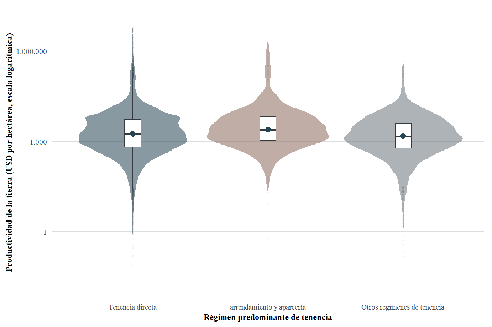
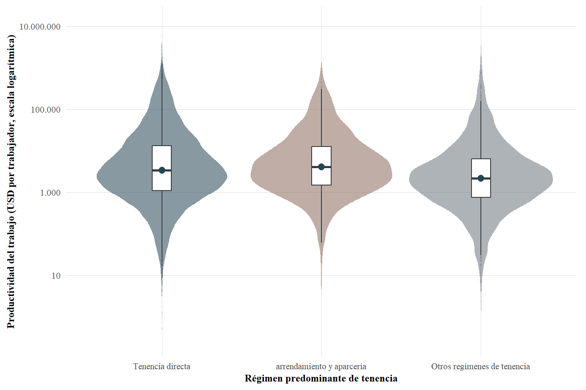
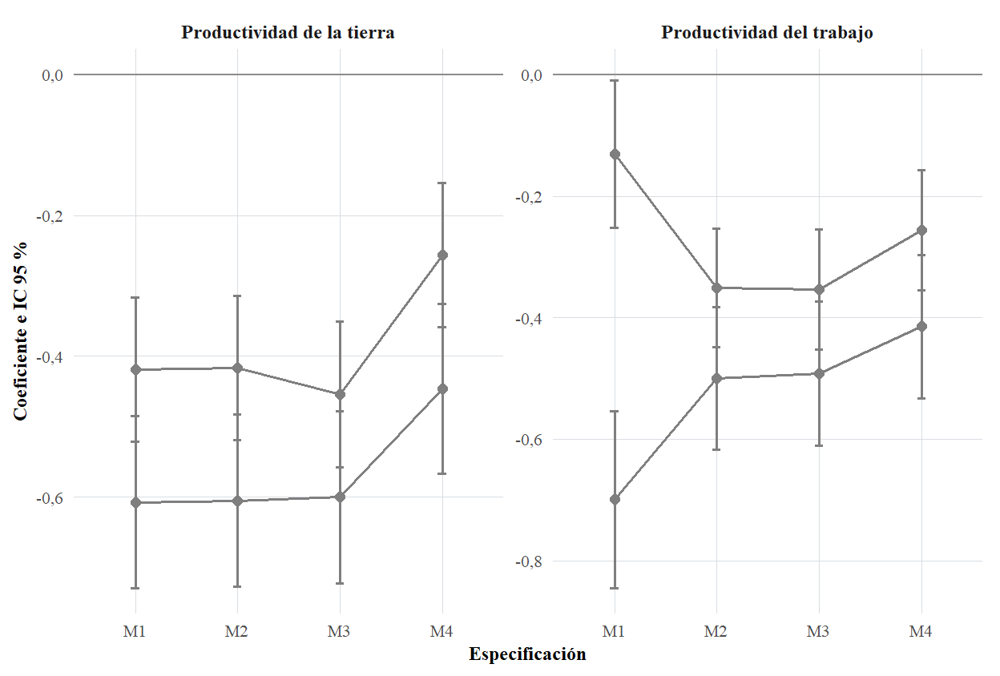
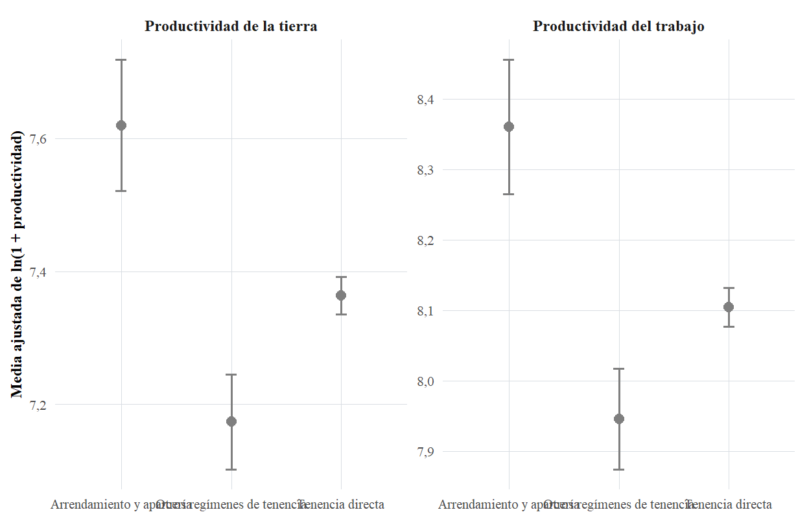
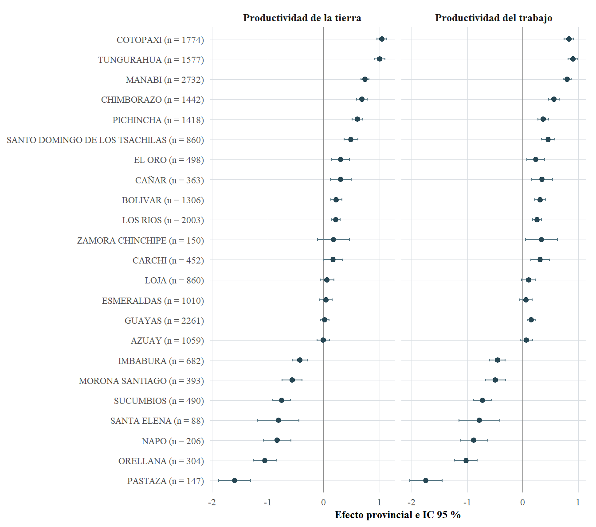
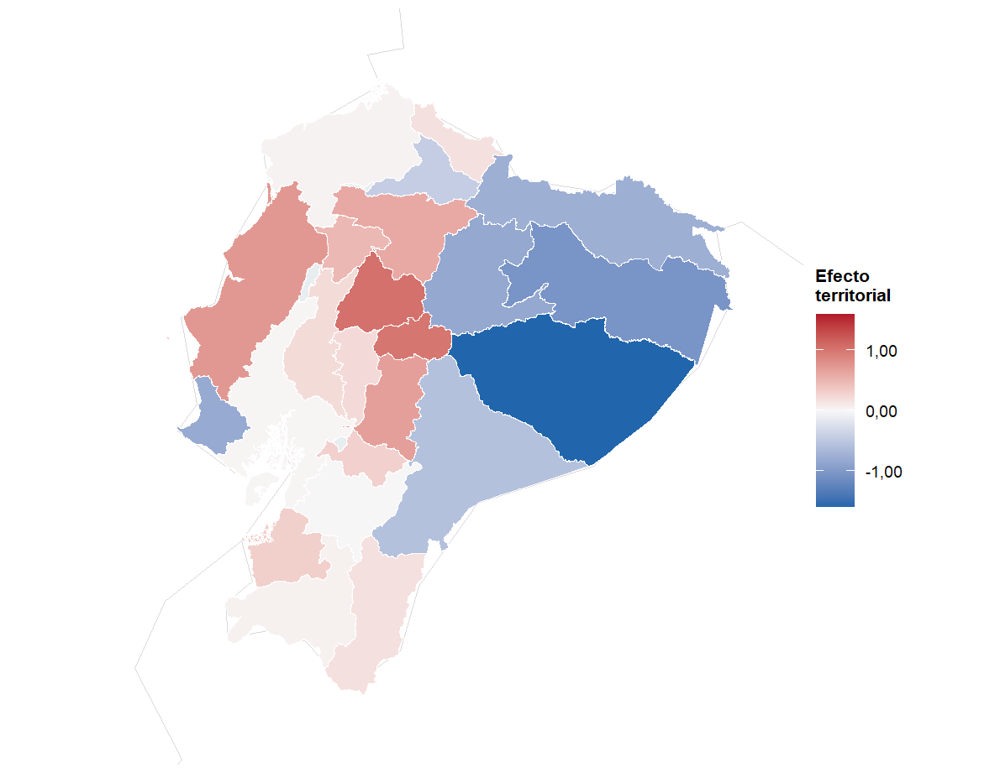
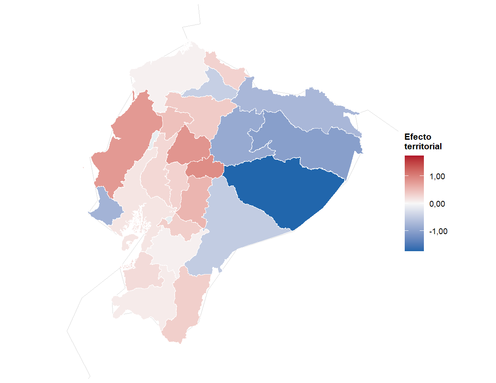
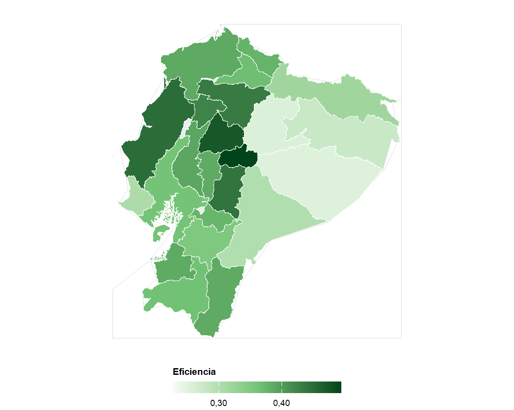
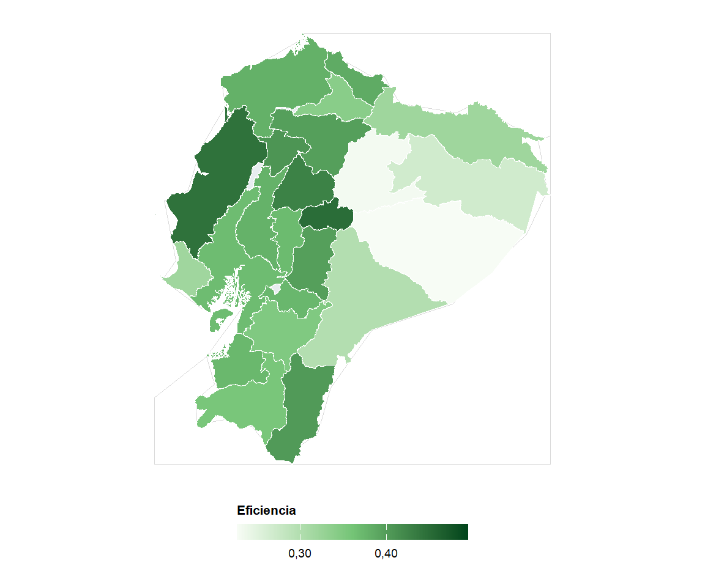
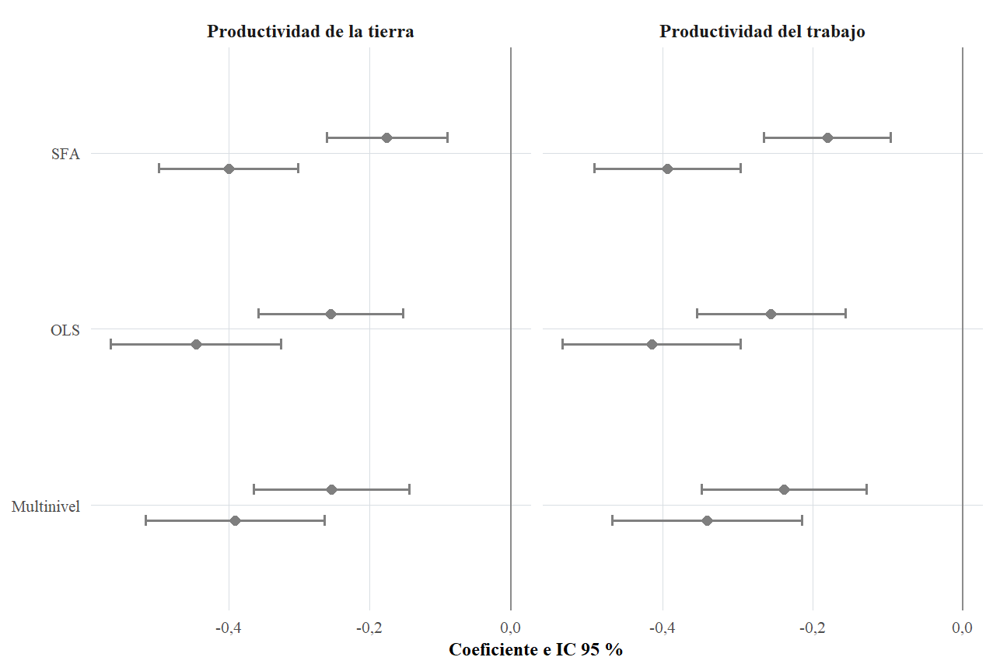

## Pregunta central

> **¿Cómo se asocia el régimen predominante de tenencia de la tierra con la productividad de las UPA del Ecuador continental?**

La tesis distingue tres dimensiones:

Tierra

Valor bruto estimado por hectárea

Trabajo

Valor bruto estimado por persona ocupada

Frontera

Posición relativa frente a una frontera monetaria condicionada

::: {.notes}
La pregunta no es qué régimen es “mejor” en términos absolutos. La pregunta es si existen diferencias sistemáticas después de considerar escala, capacidades observadas, tecnología y territorio.
:::

## El punto de partida: una estructura agraria desigual

86,5 %

de las UPA muestrales tiene menos de 10 ha

8,4 %

de la superficie muestral está en esas UPA menores de 10 ha

66,9 %

de la superficie muestral se concentra en el 2,0 % de UPA de 200 ha o más

La comparación de productividad exige considerar simultáneamente <strong>tenencia y escala</strong>.

::: {.notes}
Estas cifras son muestrales, no estimaciones expandidas. Su función aquí es mostrar la heterogeneidad estructural del sector.
:::

## Tres conceptos que no deben confundirse

<strong>Propiedad</strong> 
Régimen jurídico de dominio.

<strong>Tenencia</strong> 
Condiciones de acceso, uso, control y transferencia de la tierra.

<strong>Seguridad de la tenencia</strong> 
Estabilidad y protección de los derechos. No equivale automáticamente a disponer de un título formal.

La tesis analiza <strong>régimen predominante de tenencia</strong>; no mide directamente seguridad jurídica ni calidad contractual.

## Vacío y contribución doctoral

<strong>Vacío empírico</strong> 
Escasa evidencia reciente a escala nacional que vincule tenencia con resultados productivos de cada UPA.

<strong>Vacío metodológico</strong> 
Pocas comparaciones conjuntas entre asociaciones promedio, heterogeneidad territorial y fronteras paramétricas.

<strong>Vacío conceptual</strong> 
Tenencia, propiedad, formalización y seguridad suelen tratarse como equivalentes.

<strong>Vacío de identificación</strong> 
Tenencia, escala, capacidades y localización pueden seleccionarse conjuntamente.

::: {.notes}
La contribución doctoral reside en articular estas dimensiones y en establecer qué resultados son robustos entre distintas estrategias, sin convertir asociaciones en causalidad.
:::

## Datos y muestras analíticas

42.444

UPA en la base consolidada ESPAC 2022

22.075

UPA en la muestra común OLS y multinivel

21.430

UPA con ambas productividades positivas para SFA

- Unidad de análisis: **UPA del Ecuador continental**
- Diseño: **cuantitativo, transversal, no experimental**
- Fuente: **ESPAC 2022**

Fuente: elaboración propia a partir de ESPAC 2022.

## Cómo operacionalizo la tenencia

| Régimen analítico | Modalidades principales | Papel en los modelos |
|---|---|---|
| **Tenencia directa** | dueño, herencia, usufructo, posesión | comparación |
| **Arrendamiento y aparcería** | arrendatario, aparcero | **referencia** |
| **Otros regímenes** | comunero, litigio, invasión, otras formas | comparación |

La categoría se asigna según el régimen que concentra la <strong>mayor superficie</strong> dentro de cada UPA.

## Dos productividades, dos mecanismos

PT

<strong>Productividad de la tierra</strong> valor bruto estimado / hectárea

PL

<strong>Productividad del trabajo</strong> valor bruto estimado / persona ocupada

Una UPA puede generar mucho valor por hectárea sin presentar simultáneamente alta productividad por trabajador.

## Estrategia empírica: tres preguntas distintas

<strong>OLS + HC1</strong>  
¿Persisten las diferencias promedio condicionadas?

<strong>Multinivel</strong>  
¿Cuánta variación corresponde al nivel provincial?

<strong>SFA</strong>  
¿Dónde se ubican las UPA respecto de una frontera monetaria condicionada?

La robustez procede de la <strong>convergencia entre métodos</strong>, no de tratar sus parámetros como equivalentes.

## Descripción: las medianas ya muestran diferencias

2.486

USD/ha <strong>Arrendamiento y aparcería</strong>

1.790

USD/ha <strong>Tenencia directa</strong>

1.503

USD/ha <strong>Otros regímenes</strong>

4.075

USD/persona <strong>Arrendamiento y aparcería</strong>

3.275

USD/persona <strong>Tenencia directa</strong>

2.140

USD/persona <strong>Otros regímenes</strong>

Medianas sobre observaciones con productividad positiva. Fuente: ESPAC 2022.

## Productividad observada según tenencia

::: {.columns}
::: {.column width="50%"}

:::
::: {.column width="50%"}

:::
:::

Figuras originales de la tesis. Lectura descriptiva: no constituyen efectos causales.

## OLS: la brecha persiste al condicionar

−0,256

Tenencia directa Productividad de la tierra

−0,446

Otros regímenes Productividad de la tierra

p &lt; 0,001

ambos contrastes frente a arrendamiento y aparcería

−0,256

Tenencia directa Productividad del trabajo

−0,415

Otros regímenes Productividad del trabajo

N = 22.075

misma muestra común de estimación

::: {.notes}
Estos son coeficientes sobre la escala transformada del resultado. No deben presentarse como porcentajes exactos sin transformación adicional.
:::

## Estabilidad del resultado entre especificaciones {.figure-focus}

{.figure-main fig-align="center"}

Los coeficientes cambian de magnitud al incorporar controles, pero <strong>no cambian de signo</strong> ni alteran la ordenación sustantiva entre regímenes.

::: {.notes}
Aquí interesa la estabilidad del resultado institucional. M1 a M4 incorporan progresivamente controles. La dirección de las asociaciones se mantiene.
:::

## Predicciones ajustadas: la ordenación se conserva {.figure-focus}

{.figure-main figure-pred fig-align="center"}

Después de condicionar por escala, características sociodemográficas y tecnología, <strong>arrendamiento y aparcería mantienen el mayor nivel ajustado</strong>.

::: {.notes}
Esta diapositiva traduce los coeficientes a una escala más intuitiva de predicciones ajustadas. Debe leerse como comparación condicionada, no como efecto causal.
:::
## La escala no significa lo mismo para tierra y trabajo

<strong>Productividad de la tierra</strong>  
La superficie mantiene una asociación <strong>negativa</strong>.

<strong>Productividad del trabajo</strong>  
La escala se asocia de forma <strong>positiva pero cóncava</strong>.

La aparente contradicción se resuelve al reconocer que tierra y trabajo son <strong>dimensiones distintas del desempeño</strong>.

## El territorio importa

0,150

ICC nulo Productividad de la tierra

0,092

ICC nulo Productividad del trabajo

22.075

UPA en los modelos multinivel

0,118

ICC completo Productividad de la tierra

0,114

ICC completo Productividad del trabajo

↓ AIC/BIC

mejor ajuste relativo que OLS sobre la misma muestra

## Heterogeneidad provincial condicionada {.figure-focus provincial-focus}

{.caterpillar-figure fig-align="center"}

Incluso después de controlar covariables, <strong>persisten diferencias provinciales sistemáticas</strong>.

::: {.notes}
El gráfico muestra efectos provinciales condicionados. El objetivo oral no es leer cada provincia, sino evidenciar que la localización sigue aportando heterogeneidad después de controlar las características observadas.
:::
## El patrón territorial difiere entre indicadores

::: {.columns}
::: {.column width="50%"}

:::
::: {.column width="50%"}

:::
:::

No existe un único “territorio productivo”: los patrones espaciales cambian según la dimensión del desempeño.

## SFA: qué significa aquí “eficiencia”

La especificación separa:

- **ruido simétrico**, y
- un **componente unilateral** asociado con distancia a la frontera.

<strong>Interpretación correcta:</strong> posición relativa respecto de una <strong>frontera de productividad monetaria condicionada</strong>.  
No es una función física completa de producción y <strong>1 − eficiencia no equivale automáticamente a producción recuperable</strong>.

## SFA: distribución de la posición relativa

0,404

media · productividad de la tierra mediana: 0,409

0,387

media · productividad del trabajo mediana: 0,392

- Muestra: **21.430 UPA**
- Half-normal como especificación principal
- Truncated-normal como sensibilidad

La robustez es mayor para el <strong>orden relativo</strong> y la dirección de las asociaciones que para el nivel absoluto de eficiencia.

## La frontera también tiene geografía

::: {.columns}
::: {.column width="50%"}

:::
::: {.column width="50%"}

:::
:::

Promedios provinciales de eficiencias individuales; lectura descriptiva complementaria.

## Convergencia entre métodos: el resultado se mantiene {.figure-focus}

{.figure-main figure-coefplot fig-align="center"}

OLS, multinivel, sensibilidades territoriales y SFA conservan la misma dirección sustantiva: <strong>tenencia directa y otros regímenes se sitúan por debajo de arrendamiento y aparcería en el desempeño condicionado</strong>.

## Qué sí permite concluir la tesis

1. El régimen predominante de tenencia **contiene información asociada** con ambas productividades.
2. La tenencia directa **no presenta una ventaja productiva automática** frente a arrendamiento y aparcería.
3. La escala opera de forma distinta sobre tierra y trabajo.
4. La provincia aporta heterogeneidad adicional.
5. El patrón de tenencia es estable entre especificaciones distintas.

## Qué no permite concluir

<strong>No identifica efectos causales.</strong>

- No observa qué ocurriría si una misma UPA cambiara de régimen.
- No mide directamente seguridad jurídica ni calidad contractual.
- No observa completamente suelo, clima, mecanización, crédito, asistencia técnica, inversión o distancia a mercados.
- La SFA depende de forma funcional y supuestos distributivos.

Asociación condicionada ≠ causalidad

## Contribución doctoral

<strong>Sustantiva</strong> 
Distingue tierra y trabajo y evita una jerarquía simple entre regímenes.

<strong>Empírica</strong> 
Integra microdatos nacionales recientes a escala de UPA.

<strong>Metodológica</strong> 
Contrasta media condicionada, territorio y frontera paramétrica.

<strong>Territorial</strong> 
Cuantifica cuánto de la heterogeneidad permanece entre provincias.

## Implicaciones

- La política de productividad no debería reducirse a **cambiar la modalidad jurídica de tenencia**.
- La seguridad de los derechos sigue siendo relevante, pero necesita complementos: **infraestructura, mercados, financiamiento, información y tecnología**.
- Los mercados de arrendamiento pueden cumplir una función de asignación, aunque el mecanismo específico **no está identificado causalmente**.
- Las intervenciones deben reconocer la **heterogeneidad territorial** y las diferencias entre productividad de la tierra y del trabajo.

## Mensaje final

La tenencia importa, pero <strong>no de forma aislada</strong>: su asociación con el desempeño agropecuario debe interpretarse junto con la escala, las capacidades observadas, la tecnología, el territorio y los límites de identificación.

 

<strong>Ese es el principal resultado integrador de la tesis.</strong>

## Gracias {.section-title}

### Preguntas del tribunal

José Vicente Ordóñez Yaguache  
Universidade de Santiago de Compostela · 2026

---

## Selección de muestra {.apendice}

| Etapa | UPA |
|---|---:|
| Base consolidada | 42.444 |
| Casos completos OLS / multinivel | 22.075 |
| Ambas productividades > 0 para SFA | 21.430 |

Las muestras analíticas no son estimaciones expandidas del número nacional de UPA.

## Variables principales {.apendice}

**Resultados**
- Productividad monetaria de la tierra
- Productividad monetaria del trabajo

**Exposición principal**
- Régimen predominante de tenencia

**Covariables**
- escala
- edad
- educación
- sexo
- internet
- riego
- fertilizantes
- plaguicidas
- provincia

## Robustez OLS {.apendice}

| Resultado | Sensibilidad | Directa | Otros |
|---|---|---:|---:|
| Tierra | Principal | −0,256 | −0,446 |
| Tierra | Ponderado | −0,303 | −0,449 |
| Trabajo | Principal | −0,256 | −0,415 |
| Trabajo | Ponderado | −0,267 | −0,411 |

Referencia: arrendamiento y aparcería. Todos los contrastes mostrados: p &lt; 0,001.

## Robustez territorial {.apendice}

| Resultado | Régimen | Multinivel | Efectos fijos provinciales |
|---|---|---:|---:|
| Tierra | Directa | −0,254 | −0,254 |
| Tierra | Otros | −0,391 | −0,389 |
| Trabajo | Directa | −0,238 | −0,238 |
| Trabajo | Otros | −0,341 | −0,339 |

La conclusión institucional no depende de representar el territorio con efectos aleatorios o con indicadores provinciales fijos.

## Comparación de ajuste {.apendice}

| Modelo | AIC | BIC | Log-verosimilitud |
|---|---:|---:|---:|
| OLS tierra | 91.088 | 91.200 | −45.530 |
| Multinivel tierra | 89.612 | 89.732 | −44.791 |
| OLS trabajo | 90.827 | 90.947 | −45.399 |
| Multinivel trabajo | 89.659 | 89.787 | −44.813 |

Comparaciones realizadas dentro de la misma variable dependiente y sobre la misma muestra.

## Sensibilidad SFA {.apendice}

- Half-normal: especificación principal.
- Truncated-normal: sensibilidad distributiva.
- Los signos y coeficientes de tenencia cambian poco.
- Las eficiencias individuales presentan **correlaciones > 0,98** entre ambas distribuciones.
- Las medias y gamma sí cambian de forma apreciable.

Por eso la interpretación más defendible se centra en el <strong>orden relativo</strong> y la dirección de las asociaciones, no en un nivel absoluto de “ineficiencia recuperable”.

